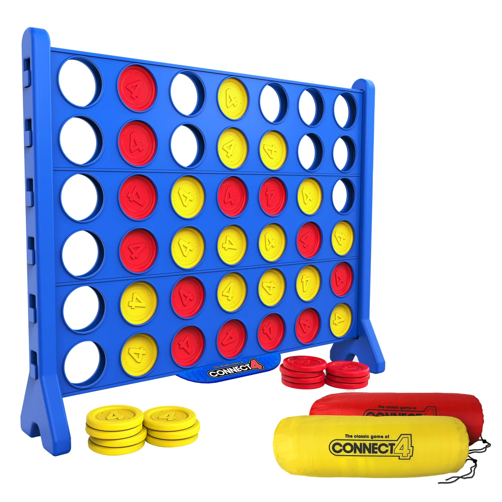

# Connect 4

## Video Demo:  <https://github.com/Alireza-njt/Connect-Four/releases/download/video/CS50.Python.Final.Project_Connect.4.with.Minimax.Alpha-Beta.Pruning.mp4>

This project represents my final submission for Harvard's CS50 Introduction to Programming with Python course - a fully-functional Connect 4 implementation featuring an intelligent AI opponent. Designed for terminal/IDE environments, the game combines classic gameplay with modern artificial intelligence techniques.

## Project Origins
The architecture draws inspiration from:
- Project 2 of CS50's AI course (Tic-Tac-Toe implementation)
- Traditional Minimax algorithm concepts
- Alpha-beta pruning optimizations
- Classic board game implementations

## Technical Implementation

### Core Game Engine

#### `initial_state()`
Initializes the game board as a 6x7 grid (standard Connect 4 dimensions) with all positions empty. The state is represented as a 2D list containing:
- `Red` pieces (player/AI)
- `Yellow` pieces (player/AI)
- `Empty` slots

#### `actions()`
Dynamically calculates all valid moves by:
1. Scanning columns from bottom to top
2. Identifying the first available empty slot
3. Returning coordinates for valid moves
4. Enforcing game rules (pieces fall to lowest available space)

#### `result()`
Generates new game states by:
- Creating deep copies of the current state
- Validating move legality
- Applying player moves
- Preventing illegal state modifications

### Game Logic

#### `winner()`
Implements victory detection through:
1. Horizontal line checks (4-connected in rows)
2. Vertical line checks (4-stacked in columns)
3. Diagonal checks (both ascending and descending)
4. Comprehensive board scanning
5. Early termination when victory detected

#### `terminal()`
Determines game conclusion by:
- Checking for any winning condition
- Verifying board fullness (draw condition)
- Providing immediate feedback for game over states

#### `utility()`
Quantifies game outcomes with:
- +1 for AI win
- -1 for player win
- 0 for draws/non-terminal states
- Supports Minimax evaluation

### AI System

#### `minimax()`
The intelligent core featuring:
- Depth-limited search (5-ply)
- Alpha-beta pruning optimization
- Recursive state evaluation
- Move prioritization
- Adaptive strategy based on game phase

## Development Challenges

Key obstacles overcome:
1. **State Representation**: Efficient 2D list management
2. **Move Validation**: Ensuring physical game rules
3. **AI Optimization**: Balancing depth and performance
4. **Terminal Detection**: Accurate game state evaluation
5. **User Interface**: Clean terminal visualization

## Enhancements Over Base Requirements

1. **Visual Improvements**:
   - Colorama-powered colored output
   - Pyfiglet ASCII art headers
   - Formatted board display

2. **Gameplay Features**:
   - Player color selection
   - Turn-based alternation
   - Win/draw detection
   - Input validation

3. **AI Capabilities**:
   - Competitive gameplay
   - Strategic decision-making
   - Performance optimization

## How to Play

1. Run `python project.py`
2. Select your preferred color (Red/Yellow)
3. On your turn, enter a column number (1-7)
4. Watch the AI respond with its move
5. First to connect four wins!

Red always moves first (whether player or AI). The game continues until a player wins or the board fills completely (draw).
